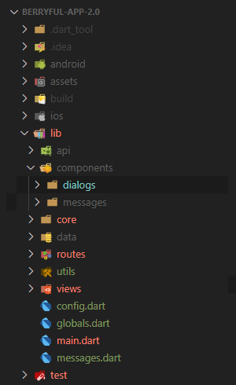
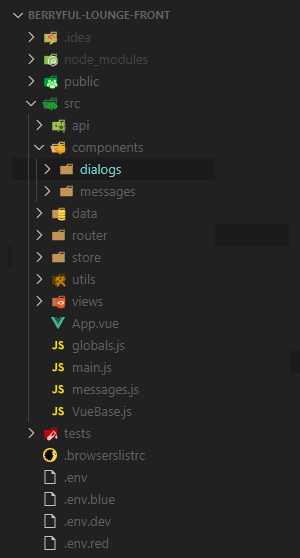

# 하이브리드 형식의 프로젝트 샘플 코드

하이브리드 형식의 프로젝트에 대한 샘플코드입니다.

## 폴더 및 파일 설명

### Flutter

* api: Rest API 호출
* components: 라우터에 등록되지 않은 UI 요소
  * dialogs: dialog 콤포넌트
  * messages: 에러 또는 워닝 메시지 콤포넌트
* core: UI와 관련없이 순수 기능을 제공하는 모듈
  * 대표 클래스는 싱글톤으로 구현
  * 복잡한 경우 서브 폴더를 만들고 여러 개의 클래스로 나눠서 작업합니다. 이 때 서브 폴더는 대표 클래스 이름과 동일하게 작성합니다.
* data: 변경이 자주 일어나지 않는 데이터를 로컬로 저장해서 처리하고 싶을 때
* routes: 화면 네비게이션이 일어나는 경로 설정
* utils: 라이브러리 모음 (중복 코드 제거 등)
* views: 라우터에 등록되어 있는 UI 모듈
* config.dart: 서버 주소 등 설정 파일 (개발환경에 따라서 분리된 설정값을 제공)
* globals.dart
  * 로그인된 사용자 정보 등 앱 전체에서 접근이 필요한 데이터를 관리합니다.
  * 웹(Vue.js)의 globals와 동기화되도록 한다. 앱의 정보를 웹에게 전달하여 동기화하는 형식을 취합니다.
* messages.dart: 에러 등의 메시지를 코드로 관리합니다.

### Vue.js

* api: Rest API 호출
* components: 라우터에 등록되지 않은 UI 요소
  * dialogs: dialog 콤포넌트
  * messages: 에러 또는 워닝 메시지 콤포넌트
* data: 변경이 자주 일어나지 않는 데이터를 로컬로 저장해서 처리하고 싶을 때
* routes: 화면 네비게이션이 일어나는 경로 설정
* store: 상태관리
* utils: 라이브러리 모음 (중복 코드 제거 등)
* views: 라우터에 등록되어 있는 UI 모듈
* globals.js
  * 웹 전체에서 접근이 필요한 데이터를 관리합니다.
  * 앱과 싱크되어야 하는 정보는 무조건 globals을 통해서 처리하도록 합니다.
  * 웹(Vue.js)의 globals와 동기화되도록 한다. 앱의 정보를 가져와서 사용하는 형식을 취합니다.
* messages.js: 에러 등의 메시지를 코드로 관리합니다.
* VueBase.js: 모든 뷰에 공통적으로 필요한 속성 및 기능을 정의하여 mixin 형태로 공유합니다.
* .env.*: 서버 주소 등 설정 파일 (개발환경에 따라서 분리된 설정값을 제공)

## 기타
* [Flutter & Vue Javascript bridge](./docs/etc/011/)
* [Flutter & Vue 데이터 동기화](./docs/etc/012/)
* [Event Bus를 활용한 UI와 기능 분리](./docs/etc/013/)
