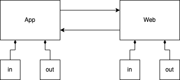

# Flutter & Vue Javascript bridge

Flutter와 Vue를 이용해서 하이브리드 앱을 개발할 때
Javascript bridge를 이용해서 메시지를 주고 받는 과정을 설명합니다.

메시지를 서로 주고 받아야 하기 때문에 App과 Web 모두 메시지가 들어오는 in 모듈과 보내는 out 모듈이 필요합니다.
따라서 Vue와 Flutter 파트의 in과 out에 해당하는 모듈에 대해서 각각 살펴보도록 하겠습니다.

실제 사용에 대한 예제는 [Flutter & Vue 데이터 동기화](/docs/etc/012/)에서 다루도록 하겠습니다.




## Vue 파트

### App to Web (bridge-in.js)

``` js
import router from "@/router";

export default {
    init() {
        window.refresh = this.refresh;
        window.loadUrl = this.loadUrl;
    },

    refresh() {
        router.go();
    },

    loadUrl(url) {
        router.push({ path: window.atob(url) });
    },
}
```
* 4-7: 앱에서는 웹의 자바스크립트 함수를 콜하는 것으로 메시지를 전달하게 됩니다.
  이때 함수는 전역에 해당하는 window의 멤버로 정의합니다.
* 32-34: 앱에서 웹화면을 새로고침하도록 메시지를 보내는 경우에 대한 예제입니다.
* 36-38: 앱에서 웹의 주소 이동을 요청하는 메시지를 보내는 경우에 대한 예제입니다.
* 37: 한글 등의 이슈로 문자열을 그대로 보내지 않고 base64로 인코딩해서 보내는 것에 유의하시기 바랍니다.

### Web to App (bridge-out.js)

``` js
/* eslint-disable */

export default {
    /**
     * Web to App Globals sync
     * @param params 싱크할 데이터
     */
    syncGlobals(params) {
        const msg = {
            code: "syncGlobals",
            params: params
        };
        this.post(msg);
    },

    /**
     * 웹앱 초기화면 로딩이 완료된 것을 네이티브에게 알려준다.
     * 네이티브는 이 신호를 받으면 인트로 화면에서 웹뷰 화면으로 전환한다.
     */
    webViewReady() {
        const msg = {
            code: "webViewReady",
        };
        this.post(msg);
    },

    ...

    post(msg) {
        try {
            App.postMessage(JSON.stringify(msg));
        } catch (e) {
            console.log(msg);
            console.log(e);
        }
    },
};
```
* 29-36: 웹에서 앱으로 메시지를 보내는 코드입니다.
  App은 웹에 실제 존재하는 객체는 아니지만 브릿지를 통해서 앱에서 생성된 객체입니다.
  이름은 여러분들이 마음대로 변경할 수 있습니다.
* 1: "App"이라는 이름으로 앱에서 생성된 객체를 호출하는데 이것이 웹에서는 정의된 적이 없습니다.
  따라서 에러가 발생하게 됩니다.
  /* eslint-disable */ 코드를 통해서 에러를 무시하도록 합니다.
* syncGlobals, webViewReady는 주석에 표시한 메시지를 앱에게 전달하는 예제입니다.


## Flutter 파트

### App to Web (bridge.dart)

``` dart
class Bridge extends Core  {
  /**
   * App to Web Globals sync
   * @param params 싱크할 데이터
   */
  void syncGlobals(String params) {
    _sendMessage("syncGlobals", params);
  }

  /**
   * 페이지 새로고침
   */
  void refresh() {
    _sendMessage("refresh", "");
  }

  /**
   * 해당 주소로 웹뷰 이동
   */
  void loadUrl(String url) {
    _sendMessage("loadUrl", url);
  }

  ...

  void _sendMessage(String functionName, String params) {
    Codec<String, String> stringToBase64 = utf8.fuse(base64);
    String encoded = stringToBase64.encode(params);

    _mainController?.runJavascript("$functionName('$encoded')");
    _subController?.runJavascript("$functionName('$encoded')");
  }
}
```
* syncGlobals, refresh, loadUrl는 주석에 표시한 메시지를 웹에게 전달하는 예제입니다.
* 27: 한글 등의 이슈로 문자열을 그대로 보내지 않고 base64로 인코딩해서 보내는 것에 유의하시기 바랍니다.

### Web to App (main.dart)

``` dart
...
class MyApp extends StatelessWidget {
  @override
  Widget build(BuildContext context) {
    return GetMaterialApp(
        onReady: () {
          _init(context);
        },
        home: Bridge().getMainWebView(Config().HOME_URL));
  }

  void _init(BuildContext context) {
    Config().init();
    Globals().init(context);

    Bridge().subscribeEvent((event) async {
      print("${event.code} - ${jsonEncode(event.params)}");
      switch (event.code) {
        case 'webViewReady': // TODO: 스프래시 화면에서 메인화면 전환 등
        break;
      }
    });
  }
}
```
* 9: Bridge 모듈은 싱글톤으로 작성되어 있습니다.
  getMainWebView() 메소드를 이용해서 웹뷰 객체를 생성해서 화면에 표시하는 과정입니다.
  Bridge 모듈로 생성된 웹뷰에는 브릿지 메시지 전송을 위한 코드가 포함되어 있습니다.
  따라서 바로 웹에게 메시지 보내는 과정은 별도로 구현하지 않아도 됩니다.
* 16-23: 웹에서 들어오는 메시지는 이벤트 버스를 통해서 전달받게 됩니다.
  이벤트 버스에 대해서는 [Event Bus를 활용한 UI와 기능 분리](/etc/013/) 문서를 참고하시기 바랍니다.