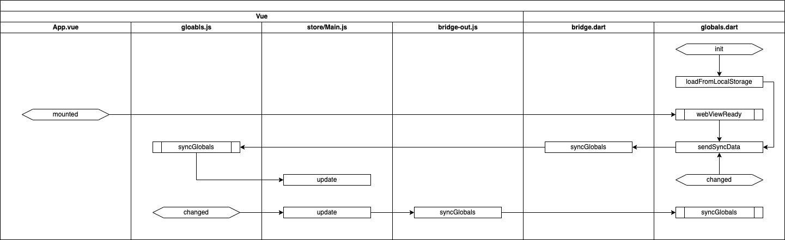

# Flutter & Vue 데이터 동기화

Flutter와 Vue를 이용해서 하이브리드 앱을 개발할 때
데이터를 공유하는 방법에 대해서 설명합니다.

## 개요

> * App
>   * 기존의 데이터를 로컬 저장소에서 읽어와서 웹에게 알림
>   * Globals가 변경되면 웹에게 알림
>   * 데이터가 변동될 때마다 로컬 저장소에 백업
> * Web
>   * Globals가 변경되면 앱에게 알림
>   * 상태관리가 필요한 데이터만 store에 전달

데이터의 저장 및 복원은 앱에서 담당하고 웹은 앱의 데이터를 전달받아서 사용하는 형식입니다.


* init
  * 앱이 실행되면 로컬 저장소에서 기존의 데이터를 가져옵니다.
* sendSyncData
  * syncGlobals 메시지를 Vue에게 전달합니다.
* globals.js - syncGlobals
  * 수신된 데이터를 Globals 모듈 내부에 저장합니다.
  * 상태관리가 필요한 데이터는 store에 전달합니다.
    * Main.js는 단순한 예입니다.
* mounted
  * Vue가 처음으로 로딩되면 webViewReady 메시지를 앱에게 전달합니다.
* webViewReady
  * 앱에 저장되어 있는 데이터를 sendSyncData를 통해서 웹에 전달합니다.
* changed
  * 웹과 앱의 Globals 모듈의 데이터가 변동되면 상대방에게 데이터를 전달하여 동기화 합니다.


## Vue 파트

``` js
import store from "@/store";
import bridgeOut from "@/bridge-out";

let syncData = {
    memberInfo: {},
};

export default {
    init() {
        window.syncGlobals = this.syncGlobals;
    },

    syncGlobals(params) {
        syncData = JSON.parse(window.atob(params));
        console.log(JSON.stringify(syncData));
        store.dispatch("main/setMemberInfo", syncData.memberInfo);
    },

    getData() {
        return syncData;
    },

    update() {
        bridgeOut.syncGlobals(syncData);
    },

    setMemberInfo(value) {
        syncData.memberInfo = value;
        store.dispatch("main/setMemberInfo", syncData.memberInfo);
        update();
    },
}
```

## Flutter 파트

``` dart
class Globals {
  static final Globals _instance = Globals._internal();

  factory Globals() {
    return _instance;
  }

  Globals._internal() {
    Bridge().subscribeEvent((event) async {
      switch (event.code) {
        case 'webViewReady': _webViewReady(); break;
        case 'syncGlobals': _syncGlobals(event); break;
      }
    });
  }

  void init(BuildContext context) async {
    ...
    _prefs = await SharedPreferences.getInstance();
    _syncData = jsonDecode(_prefs.getString('globals'));
    Bridge().syncGlobals(jsonEncode(_syncData));
  }

  void update() async {
    String json = jsonEncode(_syncData);
    Bridge().syncGlobals(json);
    _prefs.setString('globals', json);
  }

  Map<String, dynamic> getData() {
    return _syncData;
  }

  void _webViewReady() {
    Bridge().syncGlobals(jsonEncode(_syncData));
  }

  void _syncGlobals(EventData event) {
    _syncData = event.params;
  }

  var _prefs;
  var _syncData = <String, dynamic>{};
}
```