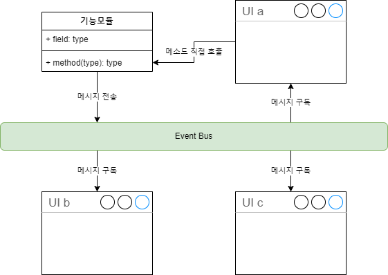
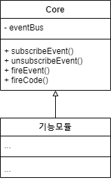

# Event Bus를 활용한 UI와 기능 분리

## 개요

본 샘플 코드는 UI 요소와 기능 요소를 분리해서 다루는 것을 원칙으로 하고 있습니다.
그 중에서도 기능 요소가 복수개의 불특정 다수에게 영향을 주는 경우에는
직접적인 메시지를 전달하지 않고 이벤트 버스를 사용해서 UI에게 메시지를 전달하도록 하고 있습니다.

UI는 기능 요소의 public 메소드를 직접 호출하도록 허용하지만,
기능 요소는 이벤트 버스를 통해서 메시지를 뿌리게 됩니다.
UI는 해당 메시지가 필요한 경우에만 구독해서 처리하는 형식을 취합니다.




## Core(기능요소) 모듈



프로젝트 전반에 영향을 미치는 기능 모듈들을 본 프로젝트에서는 Core 모듈이라고 부르고 있습니다.
Flutter의 폴더 구조를 보시면 core 폴더가 있는데요, 코어 모듈을 모두 이곳에 구현하게 됩니다.

코어 모듈은 모두 싱글톤으로 구현하고 있습니다.
반드시 그래야 하는 것은 아니지만,
프로젝트 전역에서 필요할 수 있기 때문에 싱글톤으로 구현해서 사용하고 있습니다.


## Bridge 모듈의 예

### UI에서 기능 호출이 필요한 경우

``` dart
class MyApp extends StatelessWidget {
  @override
  Widget build(BuildContext context) {
    return GetMaterialApp(
        onReady: () {
          _init(context);
        },
        home: Bridge().getMainWebView(Config().HOME_URL));
  }
  ...
}
```

### 코어에서 UI에게 메시지를 전달해야 하는 경우

아래의 코드는 Bridge가 웹으로부터 메시지를 받았을 때 이벤트를 발생시킨 경우입니다.
Bridge 모듈로부터 메시지를 받으려면 subscribeEvent() 메소드를 이용해서 구독을 요청하면 됩니다.
구독을 요청한 모든 UI에게 순차적으로 이벤트가 전달되게 됩니다. (버스를 통해서)

``` dart
class MyApp extends StatelessWidget {
  @override
  Widget build(BuildContext context) {
  ...
  void _init(BuildContext context) {
    Bridge().subscribeEvent((event) async {
      switch (event.code) {
        case 'webViewReady': // TODO: 스프래시 화면에서 메인화면 전환 등
        break;
      }
    });
  }
}
```

### EventData

이벤트 메시지가 전달될 때 파라메터로 다양한 부가 정보가 필요할 수 있는데요.
그러한 요구사항을 해결하기 위해서 이벤트 데이터는 아래와 같은 클래스의 객체가 전달되고 있습니다.

``` dart
class EventData {
  String code;
  Map<String, dynamic> params;

  EventData(this.code, this.params);
}
```
* code는 메시지의 종류를 구별하기 위해서 사용합니다.
* params는 Map을 이용해서 전달되는 부가 정보의 종류와 개수에 영향받지 않도록 하였습니다.